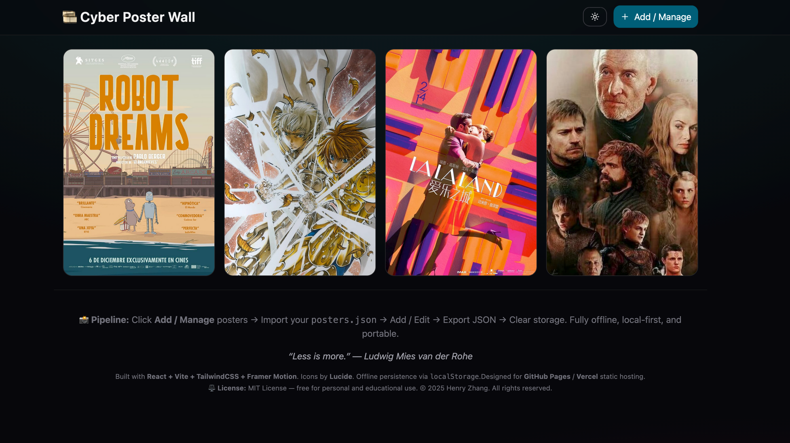

# Cyber Poster Wall

A local-first, offline-ready poster wall. Import/export `posters.json` to carry your collection like a USB drive — the JSON file is your portable library.

## Highlights

- Local-first: data lives in browser `IndexedDB`, works offline
- One-click import/export: carry your poster collection anywhere
- Poster editor: add/edit/delete with URL, paste, or file upload
- Auto-compression: images saved as JPEG Base64 for portability
- Particle gallery: a dedicated particle visualization mode
- Light/dark theme toggle

## Particle Gallery Demo


## Tech Stack

- React 19 + Vite
- Tailwind CSS v4
- Framer Motion
- Lucide Icons
- IndexedDB (local persistence)

## Quick Start

```bash
npm install
npm run dev
```

Build and preview:

```bash
npm run build
npm run preview
```

Deploy (GitHub Pages):

```bash
npm run deploy
```

## Workflow

1. Click **Add / Manage** to open the manager
2. Import `posters.json` (optional)
3. Add / edit / delete posters
4. Export `posters.json` to carry your collection
5. Optional: clear local data (IndexedDB)

## Data Format

Example `posters.json`:

```json
[
  {
    "id": "blade-runner-2049-1730560220000",
    "title": "Blade Runner 2049",
    "posterUrl": "data:image/jpeg;base64,...",
    "review": "Hypnotic neon-noir that meditates on memory and meaning."
  }
]
```

Fields:

- `id`: unique identifier (imports de-dupe by `id`)
- `title`: poster title
- `posterUrl`: Base64 DataURL
- `review`: short review (optional)

## Storage & Migration

- Uses `IndexedDB` for larger storage (fits Base64 images better)
- On first run, attempts one-time migration from old `localStorage`
- If no data exists, loads a built-in sample poster

## Notes

- URL import may fail due to CORS; use paste/upload instead
- Images are compressed to JPEG (default width 800px, quality 0.85)
- Imports merge with existing data and de-dupe by `id`

## Key Files

- `src/App.jsx`: main UI and core interactions
- `src/ParticleGallery.jsx`: particle gallery view
- `src/db.js`: IndexedDB storage and migration

## License

MIT License — free for personal and educational use.
© 2025 Henry Zhang. All rights reserved.
